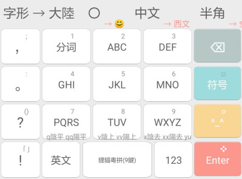

# Rime Leimaau's Cantonese Input Scheme | 狸貓粵拼

 

> * 採用香港語言學學會粵語拼音方案
> * 提供聲調輸入 q平 v上 x去 （雙擊爲陽調）和多種字形轉換
> * 提供四種反查方案，[`]普拼反查粵拼，[x]五筆畫反查粵拼，[v]倉頡五代反查粵拼，[r][粵語兩分](https://github.com/CanCLID/rime-loengfan)反查粵拼
> * PC上按Ctrl+Enter可將提示音上屏，按Ctrl+Shift+Enter可將候選項上屏

配方： ℞ **leimaau/leimaau_jyutping**

[Rime](https://rime.im) 狸貓粵拼

- 狸貓粵拼 - `leimaau/leimaau_jyutping`
	- 狸貓粵拼 - `leimaau_jyutping`
	- 狸貓粵拼(IPA) - `leimaau_jyutping_ipa`

此處存放我設計的「狸貓粵拼」以及輸入方案的配置。收錄原則，爲研究方便，一切字形和讀音盡數收錄，不爲正音正字。

## 安卓端

分支[`leimaau_jyutping_android`](https://github.com/leimaau/leimaau_jyutping/tree/leimaau_jyutping_android)中存放配置同文輸入法需要的文件。

若嫌手工配置麻煩，[**此處**](https://github.com/leimaau/leimaau_jyutping/releases)已通過 apktool 重新打包，下載安裝即可。

